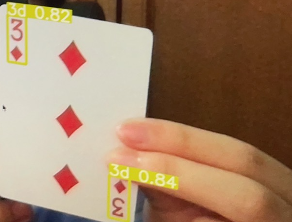

<!--
*** Thanks for checking out the Best-README-Template. If you have a suggestion
*** that would make this better, please fork the repo and create a pull request
*** or simply open an issue with the tag "enhancement".
*** Thanks again! Now go create something AMAZING! :D
***
***
***
*** To avoid retyping too much info. Do a search and replace for the following:
*** github_username, repo_name, twitter_handle, email, project_title, project_description
-->

<!-- PROJECT LOGO -->
<br />
<p align="center">
  <h3 align="center">Cards Recognition Dataset Generation</h3>

  <p align="center">
    Google Colaboratory Notebook for generating training dataset for YOLOv5
  </p>
</p>

<!-- TABLE OF CONTENTS -->
<details open="open">
  <summary><h2 style="display: inline-block">Table of Contents</h2></summary>
  <ol>
    <li>
      <a href="#getting-started">Getting Started</a>
      <ul>
        <li><a href="#prerequisites">Prerequisites</a></li>
        <li><a href="#installation">Installation</a></li>
      </ul>
    </li>
    <li><a href="#usage">Usage</a></li>
  </ol>
</details>

<!-- GETTING STARTED -->

## About This Project

This is a Google Colab version of [repository](https://github.com/geaxgx/playing-card-detection). In additional to the original notebook, this notebook can interact with files from Google Drive.

## Getting Started

To get a copy up and running follow these simple steps.

### Prerequisites

- Videos of all 52 cards
- Google Account
- If the model are going to be trained on Colab, a Colab Pro subscription is recommended

### Installation

1. Clone the repo
   ```sh
   git clone https://github.com/pholawat-tle/Cards-Recognition-DatasetGeneration
   ```
2. Upload the .ipynb file to Google Colab
3. Upload the videos of all 52 cards to the Colab VM or your Google Drive
4. In case the videos are on Google Drive, mount Google Drive to your VM

_For the script to run properly, some variables that ends with `_dir` need may need to be changed to fit your environment_

<!-- USAGE EXAMPLES -->

## Usage

By running the code in the notebook, you should get weights file name `best.pt` and `last.pt`. To use these weights in your application, refer to [this guide](https://github.com/ultralytics/yolov5/issues/36).


